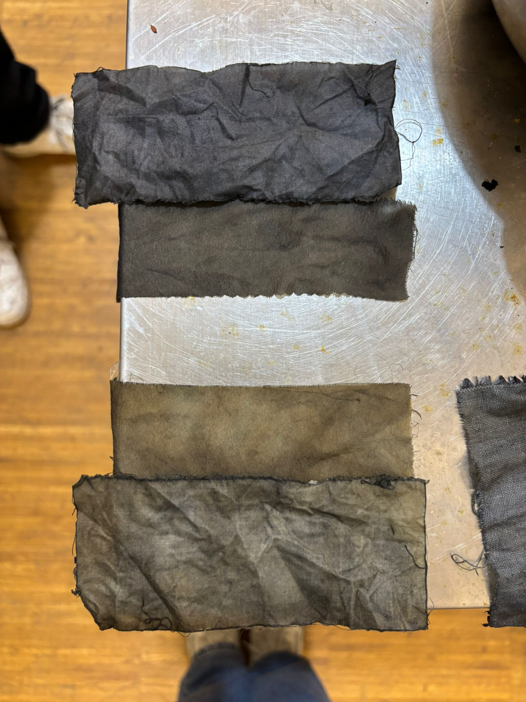
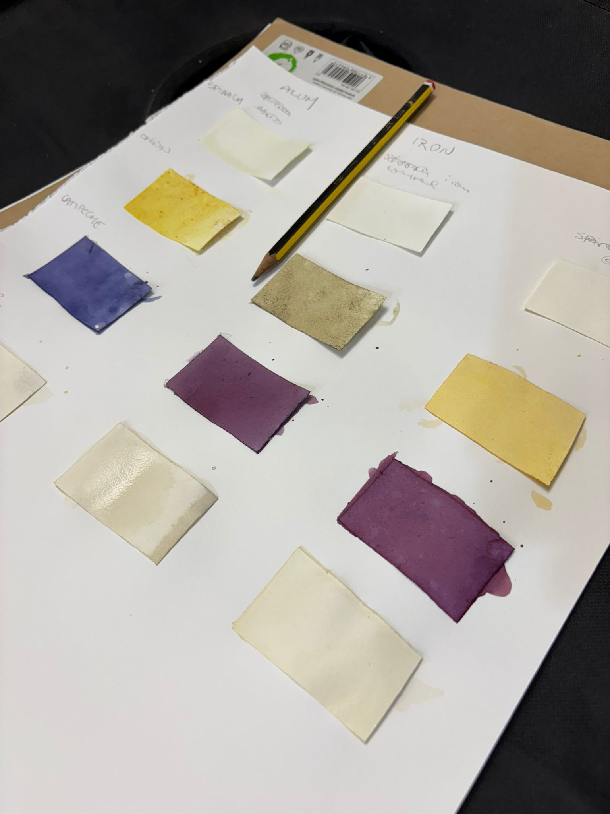

---
hide:
    - toc
---

!!! info "Biochromes"
    ==FACULTY==: Petra Garajova
    
    ==CALENDAR==: 08/10/2024 - 11/10/2024

    ==TRACK==: Reflection

!!! quote

    # "Nature always wears the colors of the spirit." — Ralph Waldo Emerson
    
!!! abstract "Notes"
    ## What are **Biochromes**?

    Biochromes are natural pigments found in living organisms. They are responsible for the wide range of colors seen in plants, animals, and microorganisms. These pigments play various roles, including attracting mates, camouflage, photosynthesis, and protection against harmful UV radiation.

    !!! abstract ""
        ## Types of Biochromes:
    
        !!! note ""
            Chlorophyll

            Color: Green
            Function: Essential for photosynthesis in plants, algae, and cyanobacteria.
            

        !!! note ""    
            Carotenoids

            Colors: Yellow, orange, and red

            Examples: Found in carrots (beta-carotene), autumn leaves, and flamingo feathers.
            Function: Protect cells from damage caused by light and oxidation, and contribute to photosynthesis.

        !!! note ""    
            Anthocyanins

            Colors: Red, purple, and blue
            Examples: Present in berries, flowers, and leaves.
            Function: Protect against UV radiation and oxidative stress, attract pollinators.

        !!! note ""    
            
            Melanin

            Colors: Brown, black, and some yellow
            
            Examples: Found in human skin, hair, and the feathers of birds.
        
            Function: Provides protection against UV radiation and contributes to camouflage and display.
        
        !!! note ""    
        
            Bilins (e.g., Phycobilins)

            Colors: Blue and red
        
            Examples: Found in cyanobacteria and red algae.
            
            Function: Involved in photosynthesis and coloration.
        
        !!! note ""    
            Flavonoids

            Colors: Yellow to red
        
            Examples: Found in flowers and fruits.
        
            Function: Involved in UV protection and attracting pollinators.

    !!! note ""
        ## Hands on

        During class time, we had the chance for hands-on learning. We collected different organic materials, such as purple cabbage, onion, basil, etc., as well as organic waste like leaves and fruit peels. We used these to make many amazing pigments on fabric. Additionally, by adding chemical elements such as iron, aluminum, vinegar, and baking soda, we could easily change the pH level of the pigment, which altered the color.

        {: style="height:300px;width:420px"}

    !!! note ""

        | Chemical   |Effect                         | Example of Color Change             |pH Level|
        | -----------| ------------------------------|-------------------------------------|--------|
        | Iron       | Darkens, muting effect        |Yellow → Olive green; Red → Brownish |Slightly Acidic (pH ~3-5)|
        | Alum       | Brightens and fixes colors    |Yellow → Bright yellow; Red → Vibrant|Mildly Acidic (pH ~3-4)|
        | Vinegar    | Acidic, enhances warm tones   |	Purple cabbage → Red/Pink          |Acidic (pH ~2-3)|
        | Baking Soda| Alkaline, enhances cool tones |Purple cabbage → Blue/Green          |Basic (pH ~8-9)|

        !!! warning ""
            - Alum (Potassium Aluminum Sulfate): Brightens colors and helps fix them to the fabric.
            
            - Iron (Ferrous Sulfate): Darkens colors and produces more muted, earthy tones.    

        {: style="height:300px;width:420px"}

    !!! note ""
        ## Also, 
        
        adding alumbre roca (potassium alum or aluminum sulfate) to natural dyes acts as a mordant, which helps improve the dyeing process. A mordant binds the dye to the fibers, making colors more vibrant, long-lasting, and less prone to fading.     
        

        {: style="height:300px;width:300px"}

    !!! note ""
        ## Various Fabric 

        | Fabric  |Type                       | Dye Absorption          |Expected Results|
        | -----------| ------------------------------|-------------------------------------|--------|
        | Cotton      | Natural plant-based fiber       |Good absorption, but can be uneven|Colors may appear more muted or pastel.|
        | Alum       | Semi-synthetic (plant-derived)   |Excellent absorption, smooth surface|Bright and vibrant colors; good uniformity.|
        | Vinegar    | Natural plant-based fiber  |	Moderate absorption, rougher texture |Slightly uneven, earthy tones with more texture.|
        | Baking Soda|Natural animal-based fiber |Excellent absorption, glossy surface |Rich, vibrant colors with a lustrous finish.|

        {: style="height:400px;width:280px"}
        {: style="height:400px;width:280px"}
        {: style="height:400px;width:280px"}

        
        - Different mixtures of dye sources, mordants, ph changing acids and fabrics.

!!! example "Reflection"
    This seminar was a really interesting course for me because it relates to my thesis project, which focuses on waste, nature, and the abanico. After taking this course, I am considering applying natural dye techniques to the fabric used in my abanico design.