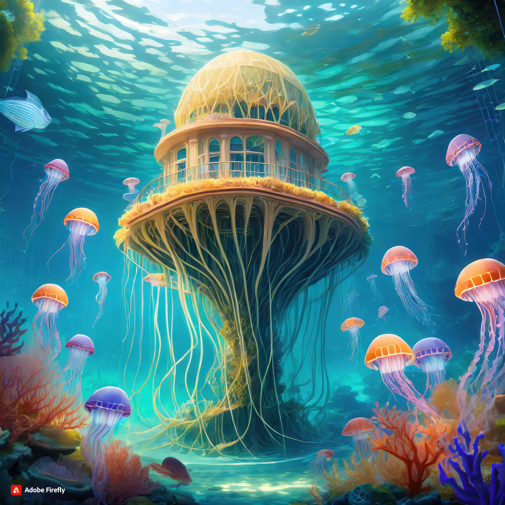
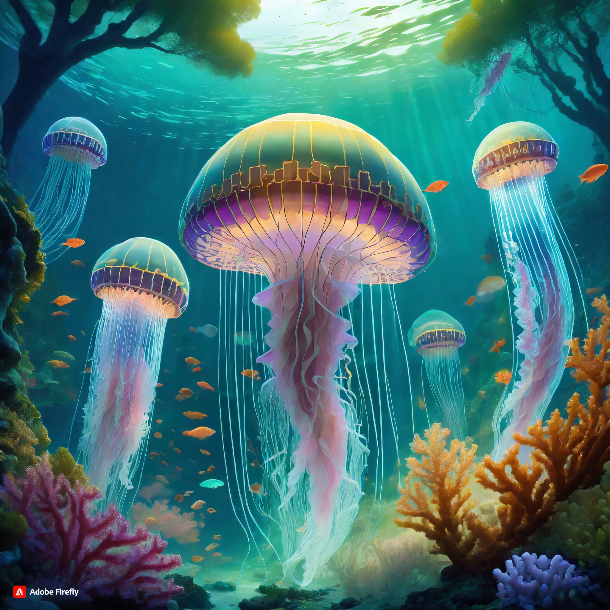

{: style="height:561px;width:717px"}
{: style="height:561px;width:717px"}
{: style="height:561px;width:717px"}
{: style="height:561px;width:717px"}
{: style="height:561px;width:717px"}
{: style="height:561px;width:717px"}
!!! danger  ":radioactive_sign: **QUESTION**"
    >>>## HOW TO GROWN ART INSIDE OF THE OCEAN?

!!!success
    ### :bulb: **SeaBasedPlants**

    Designing a genetically modified organism (GMO) for an underwater art exhibition blends science with aesthetics in a fascinating way.  

// this code makes a box

!!! success ":thumbsup: Branch"

    ## Designing a genetically modified organism (GMO) for an underwater art exhibition blends science with aesthetics in a fascinating way.  
    * Bioluminescence 
                - One of the most visually striking features we could engineer into our plant is bioluminescence. This is the ability to produce light, like some jellyfish or deep-sea fish. Imagine underwater plants that glow in the dark, creating a natural, living light show. 

    * Colorful Pigments
                - Typically, sea plants are shades of green, brown, or red. We could engineer plants with a wider range of colors, like vibrant blues, purples, or even patterned leaves. These colors could change based on factors like water temperature or the presence of certain chemicals, adding a dynamic element to the exhibition.

    * Shape-Shifting Structures
                - We could engineer plants that change their shape over time or in response to environmental stimuli. This could be similar to how some land-based plants open and close their flowers. Underwater, this could look like leaves that curl, fronds that expand and contract, or stems that twist and coil.

    * Interactive Elements
                - Imagine if these plants could interact with their viewers or the environment. For example, they might glow brighter when a viewer swims close or change colors when different fish species are near. This interaction would create a sense of connection between the art and its audience.

    * Sustainability and Safety
                - filtering pollutants from the water.

    By combining aesthetics with ecological awareness, we can create not just a beautiful underwater art exhibition, but also an educational and environmentally conscious experience. This project is stunning intersection with art, science, and nature.

   
:::info
:sparkle: TESTING
* Rendered Photos Created by AI
* 1st time using AI created image
:::

:::warning
:one: Cassiopea spp
>
>

| Scientific Name | Cassiopea spp | 
| -------- | -------- | 
| Common Names| Upside-Down Sea Jelly or Mangrove Jellyfish
Natural Habitat | Shallow, warm coastal waters worldwide
Size	Length | up to 12 inches (30 cm), Bell size - up to 7 inches (18 cm) in diameter
Venomous Rating | 	Non-Venomous

The ethereal world of Cassiopea spp., commonly known as Upside-Down Jellyfish, unveils a captivating dance of underwater marvels. These gelatinous beings, with their translucent bodies and gracefully trailing tentacles, create a mesmerizing spectacle in the aquatic realm.

Distinctive for their unique lifestyle, these jellyfish defy convention by choosing to reside on the ocean floor with their pulsating bells turned upward, resembling a delicate underwater meadow. The captivating beauty of their inverted posture showcases a symphony of undulating tentacles, reminiscent of delicate tendrils swaying in a mystical underwater breeze.

The intricate details of their species unfold in a delicate tapestry of hues, ranging from ethereal whites and pinks to subtle blues and greens, painting an aquatic masterpiece beneath the ocean's surface. Their pulsating motion, akin to a rhythmic dance, creates an otherworldly ambiance, inviting observers into the magical realm of these enigmatic creatures.

As ambassadors of the aquatic twilight zone, Upside-Down Jellyfish embody a harmonious blend of fragility and resilience, captivating all who dare to peer into their aquatic sanctuary. The narrative of Cassiopea spp. is a testament to the diverse and awe-inspiring wonders that thrive beneath the surface of our oceans, inviting us to marvel at the intricacies of life in this underwater ballet.

:::

:::warning
:two:: Olindias formosus
>

| Scientific Name | Olindias formosus | 
| -------- | -------- | 
| Common Names| Flower Hat Jellyfish
Natural Habitat | 	Southern Japan, Argentina, and Brazil
Size	Length | 	up to 6 inches (15 centimeters) wide
Venomous Rating | 	Moderate

Dive into the enchanting world of Olindias formosus, the Flower Hat Jellyfish, where nature unfolds a mesmerizing tapestry of aquatic elegance. These ethereal beings, adorned with delicate floral patterns on their translucent bells, gracefully navigate the ocean currents like floating gardens in a liquid ballet.

Imagine a submerged ballroom where Flower Hat Jellyfish take center stage, their bell-shaped crowns resembling exquisite floral hats crafted by underwater couturiers. The intricate lace-like patterns, reminiscent of blooming petals, lend an air of botanical sophistication to these underwater wonders.

As ambassadors of aquatic allure, Olindias formosus glides through the ocean depths, each pulsating movement akin to the rhythmic sway of blossoms in a gentle breeze. Their trailing tentacles, like cascading vines, add a dynamic flourish to the underwater ballet, creating a living masterpiece in the depths.

The Flower Hat Jellyfish invites us to witness a botanical ballet beneath the waves, where science intertwines with the poetry of nature. In this aquatic realm, Olindias formosus unfolds a story of floral elegance, a symphony of petals dancing in the liquid embrace of the deep blue.
:::

:::warning
:three: Phyllorhiza
>

| Scientific Name | Phyllorhiza | 
| -------- | -------- | 
| Common Names| Whitespotted|
Natural Habitat | 	It is native to the western Pacific from Australia to Japan, but has been introduced widely elsewhere
Size	Length | 	 can reach up to 50 cm (20 in) in bell diameter
Venomous Rating | 	Mild

Embark on a journey into the enchanting realm of Phyllorhiza, the Whitespotted jellyfish, where nature crafts a symphony of grace beneath the ocean's surface. These celestial beings, adorned with delicate white spots, drift through the currents with the poise of ethereal dancers, creating an underwater ballet of unparalleled beauty.

Imagine an aquatic ballet where Phyllorhiza takes center stage, its translucent bell resembling a living canvas adorned with whimsical white brushstrokes. The whitespots, like scattered stardust, bestow an otherworldly elegance upon these gelatinous creatures, turning the ocean depths into a celestial gallery.

As ambassadors of underwater allure, Phyllorhiza glides through the sea, each pulsating movement akin to a dance step in the choreography of the deep. Their trailing tentacles, like graceful ribbons, add a dynamic flourish to the mesmerizing performance, creating a living masterpiece in the liquid theater below.

The Whitespotted jellyfish beckons us to witness the ballet of nature, where science intertwines with the poetry of the deep blue. In the aquatic tapestry woven by Phyllorhiza, a story of elegance and celestial beauty unfolds, inviting us to marvel at the wonders of the underwater cosmos.

:::

:::info
## :sparkle: **BIG THANKS TO** 
* CHATGPT
* Adobe Firefly
* Midjourney
* DALL-E
* Stable Diffusion
- [ ] GENTE: FLORA, JORGE(W**DMEN), ANNNA, NICOLO, MINNIE, JOSEP, 

:::info
:information_source: References:
https://www.treehugger.com/extraordinary-jellyfish-species-4864147
https://www.youtube.com/watch?v=8_9toXCB4sU
https://www.youtube.com/watch?v=KJrFze7fKb0
https://www.citrusreef.com/blogs/news/types-of-jellyfish
https://www.aquariumofpacific.org/onlinelearningcenter/species/flower_hat_jelly1
https://en.wikipedia.org/wiki/Phyllorhiza_punctata
https://chat.openai.com/share/4a668d5f-1072-4089-a8b7-dda63ba7aac7
:::

Description for AI:
"Create a captivating underwater world featuring breathtaking art and remarkable architecture. Picture an enchanting environment beneath the ocean's surface, where Cassiopea spp jellyfish serve as the equivalent of towering trees in nature. The Olindias formosus jellyfish take on the role of human representations in this unique aquatic landscape. Architectural marvels are crafted using the graceful forms of Phyllorhiza jellyfish, while the surrounding space comes alive with the radiant glow of neon tropical fish, playing amidst the extraordinary underwater structures."