---
hide:
    - toc
---

!!!Warning "[0] _ {-}"
    <center>
    <font color="white">     
    
    #IN PROGRESS

    </font> 
    </center>

!!! info "Extended Intelligences"
    ==FACULTY==: Ramón Sangüesa/ Lucas Lorenzo Peña/ Pau Artigas
    
    ==CALENDAR==:28/11/2023 - 05/12/2023

    ==TRACK==: Exploration


!!! abstract "11/29/2023"

    !!! info "Surroundings"
        # It was a long-long day.

        ```mermaid
        graph LR
        Madrid --> Barcelona
        ```

        ```mermaid
        graph LR
        Cold --> Warm
        ```

        ```mermaid
        graph LR
        Cloudy/Rainy --> Sunshine
        ```


    !!! question "Who are we helping?"
        !!! failure "An AI of a remarkable Artist that already passed away ... : ( ..."
        - During the class time, I had an idea, but this idea was in my heart for a long-long-long-time. Which is to deeply study or deeply collective informations about ==Modernisme== (Catalan pronunciation: [muðərˈnizmə], Catalan for "modernism"), also known as ==Catalan modernism== and ==Catalan art nouveau== 

        >What is Catalan modernism?

        The History of Modernism in Catalan modernisme refers to not just an artistic style, but a ==cultural movement== that spanned across ==architecture, art, music, literature, and society as a whole.== 

        !!!quote 
            <center>

            ##“Modernisme has many faces and echoes a certain ambiguity,” 
            Mariàngels Fondevila, curator at Museu Nacional d'Art de Catalunya 

        </center>

        > 1. Guadi
        <center>
        {: style="height:300px;width:240px"}
        {: style="height:300px;width:240px"}


        !!!quote "Conversation"
            By having a conversation with Albert, which he is a Catalan man. 
        
            I asked Albert: "Do you like Guadi?"

            ALbert answered: "I used to like it, but nowdays, La Sagrada Familia being changed =A Lot="


        >I started to questioning myself, why people starts to hate it? Is that because Guadi? or people who building/designing/constructing it  NOWdays? People keep saying that they are pasing Guadi's art pieces to complish it. But is that a ==real== opinion done by Guadi? I mean, he is in the heaven. Or maybe he had a ==code== that later people can/needs to be ==followed==? Also, for designing a architecture is not only designing ==1/one/uno== building, it should including the surroundings, to conbine together and make a best decision. 


        !!!example
            >* what if we collected all the data of Guadi's art work then move it to AI to help us do the best calculating and fair desicions.

            https://www.instagram.com/gaudism.ai/?img_index=1
            
            {: style="height:800px;width:420px"}

            {: style="height:425px;width:330px"}
            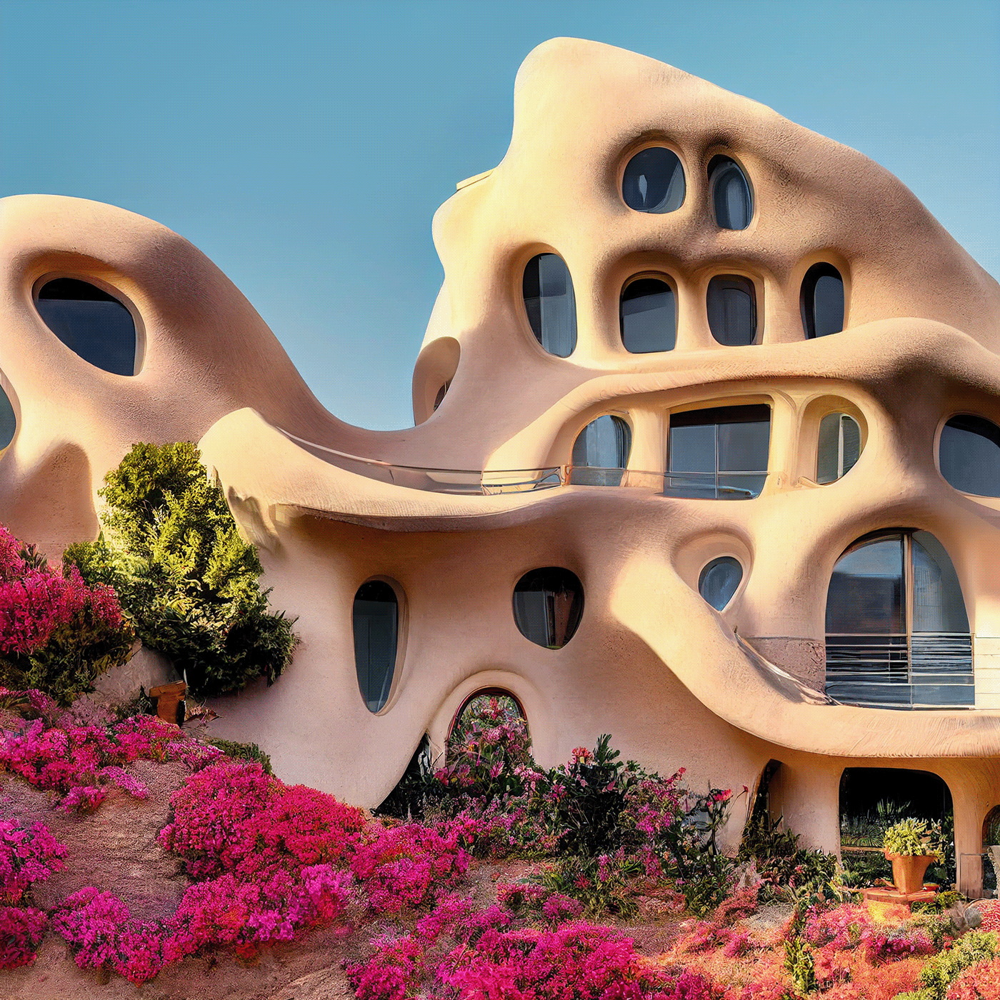{: style="height:425px;width:330px"}

            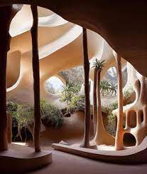{: style="height:425px;width:330px"}
            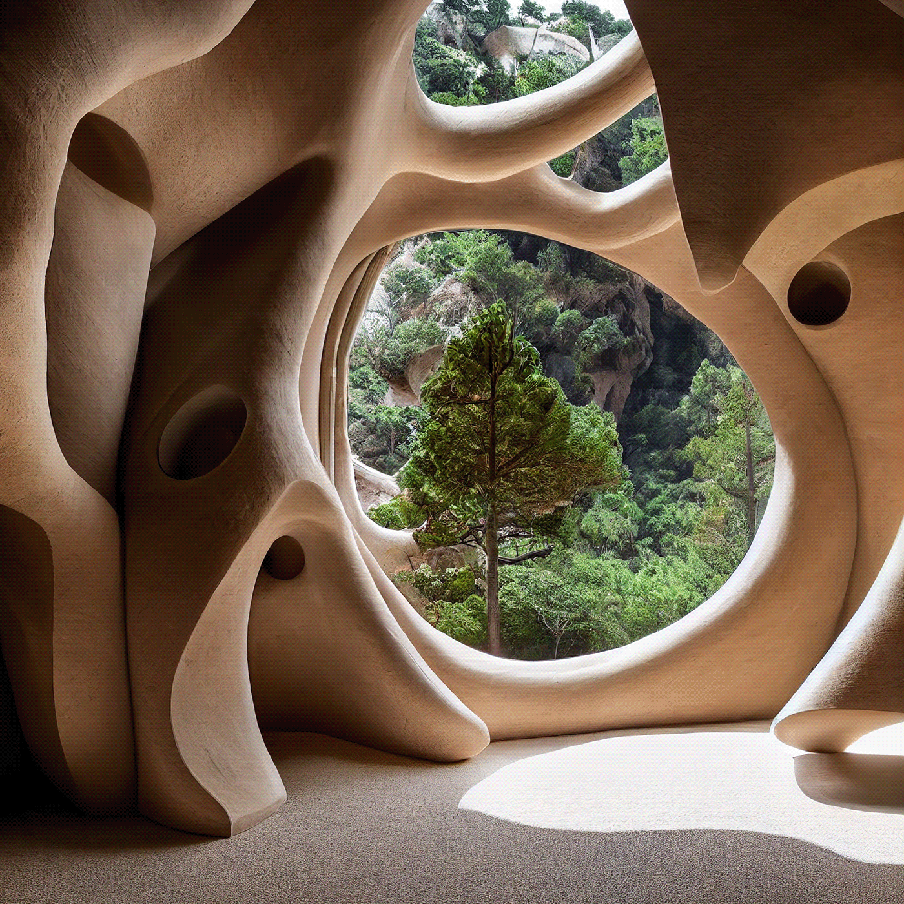{: style="height:425px;width:330px"}


        !!!info "References"
            https://www.instagram.com/gaudism.ai/?img_index=1
            https://www.veranda.com/home-decorators/a35075545/what-is-catalan-modernisme/
            https://www.youtube.com/watch?v=z7OzWUjqkms
            https://www.bilibili.com/video/BV1ox411e77P/?spm_id_from=333.337.search-card.all.click&vd_source=266489d5e7b5d644812bbc8116e63a6c

        

    !!! question "Who are we helping?"
        <center>
        # The /flat/ earth
        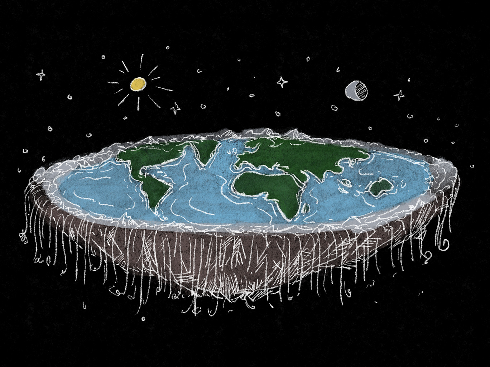{: style="height:250px;width:450px"}
        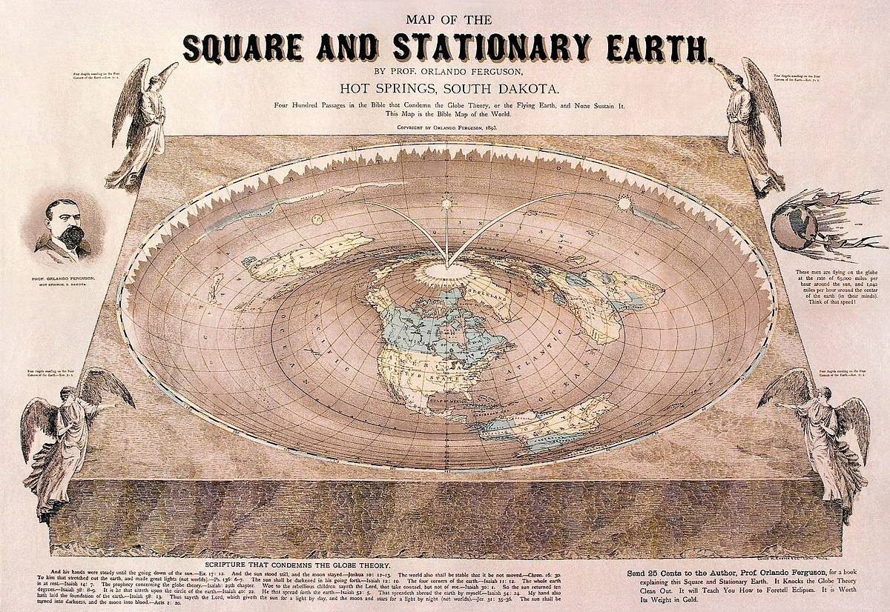{: style="height:250px;width:450px"}


        {: style="height:250px;width:450px"}
        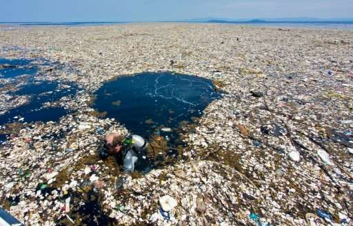{: style="height:250px;width:450px"}

        </center>

        ># *The first living robot that collects microplastics in the ocean*

        >## PNAS- Xenobot

        ==Xenobots==, named after the African clawed frog (Xenopus laevis), are synthetic lifeforms that are designed by computers to perform some desired function and built by combining together different biological tissues. Whether xenobots are robots, organisms, or something else entirely remains a subject of debate among scientists.

        {: style="height:300px;width:620px"}
        {: style="height:300px;width:320px"}
        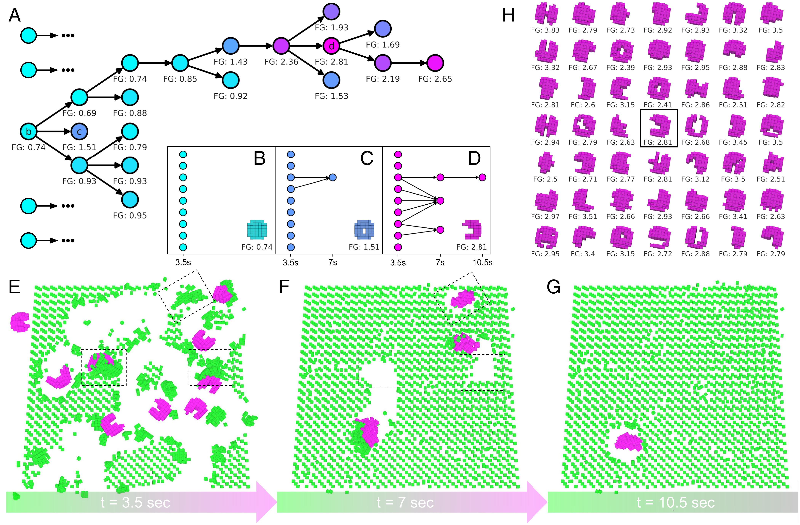{: style="height:300px;width:420px"}
        {: style="height:300px;width:320px"}


        <iframe width="560" height="315" src="https://www.youtube.com/embed/aBYtBXaxsOw?si=ZfeqWcO5EpYrvLvg" title="YouTube video player" frameborder="0" allow="accelerometer; autoplay; clipboard-write; encrypted-media; gyroscope; picture-in-picture; web-share" allowfullscreen></iframe>


        !!!info "References"    
            https://en.wikipedia.org/wiki/Xenobot

            https://www.pnas.org/doi/10.1073/pnas.1910837117

            https://www.pnas.org/post/podcast/designing-synthetic-organisms
            
            https://www.the-scientist.com/news-opinion/xenobot-living-robots-can-reproduce-69477

            https://www.britannica.com/video/179811/debris-Pacific-Ocean

            https://theoceancleanup.com/  (introduced by Carlotta Alberta Hylkema)


    !!! question "Who are we helping?"
        # The Children

        > Megan
        > <center> 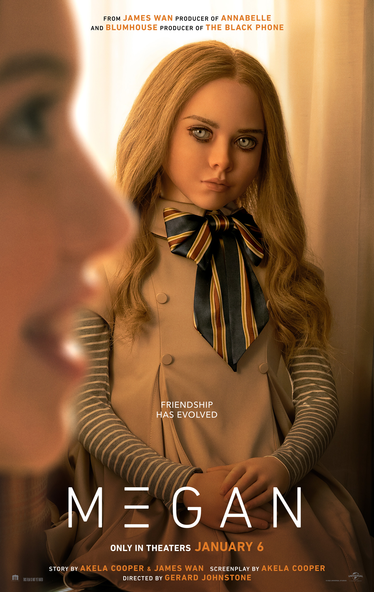{: style="height:425px;width:300px"}
        <iframe width="560" height="315" src="https://www.youtube.com/embed/BRb4U99OU80?si=_TgTalBytsx5XGmu" title="YouTube video player" frameborder="0" allow="accelerometer; autoplay; clipboard-write; encrypted-media; gyroscope; picture-in-picture; web-share" allowfullscreen></iframe>

        - M3GAN is a marvel of artificial intelligence, a lifelike doll that's programmed to be a child's greatest companion and a parent's greatest ally. Designed by Gemma, a brilliant roboticist, M3GAN can listen, watch and learn as it plays the role of friend and teacher, playmate and protector. When Gemma becomes the unexpected caretaker of her 8-year-old niece, she decides to give the girl an M3GAN prototype, a decision that leads to unimaginable consequences.
        
        - M3GAN (pronounced "Megan") is a 2022 American science fiction horror film directed by Gerard Johnstone. It was written by Akela Cooper from a story by Cooper and James Wan (who also produced with Jason Blum). Allison Williams and Violet McGraw star, Amie Donald physically portrays M3GAN, and Jenna Davis voices the character.


        !!!info "References" 
            https://www.imdb.com/title/tt8760708/
            https://en.wikipedia.org/wiki/M3GAN

        > Klara and the Sun- Novel by Kazuo Ishiguro
        > <center> {: style="height:425px;width:300px"}
        {: style="height:425px;width:300px"}
        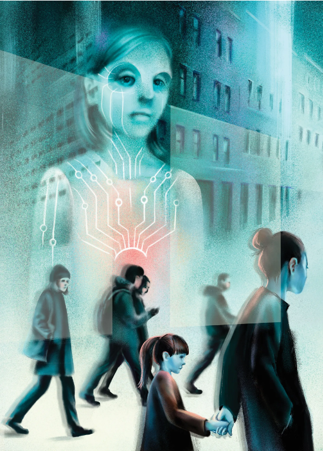{: style="height:425px;width:300px"}

        - One of my favorite fiction :)
        - From her place in the store, Klara, an Artificial Friend with outstanding observational qualities, watches carefully the behavior of those who come in to browse, and of those who pass on the street outside. She remains hopeful that a customer will soon choose her, but when the possibility emerges that her circumstances may change forever, Klara is warned not to invest too much in the promises of humans.

        !!!info "References" 
            https://www.goodreads.com/book/show/54120408-klara-and-the-sun
            https://en.wikipedia.org/wiki/Klara_and_the_Sun
            https://www.newyorker.com/magazine/2021/03/08/kazuo-ishiguro-uses-artificial-intelligence-to-reveal-the-limits-of-our-own


   
            


!!! abstrat "Datasets"

      | Dataset name | WikiArt Dataset | 
    | -------- | -------- | 
    | Dataset URL| https://datasets.activeloop.ai/docs/ml/datasets/wiki-art-dataset/ 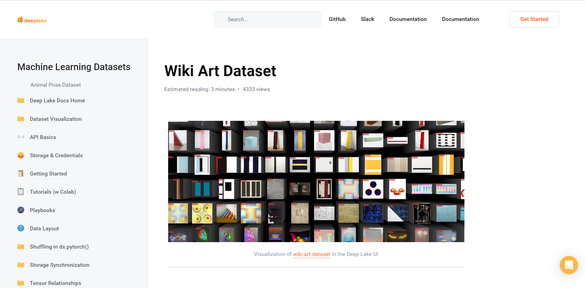{: style="height:300px;width:620px"}
    |          | https://paperswithcode.com/dataset/wikiart/ 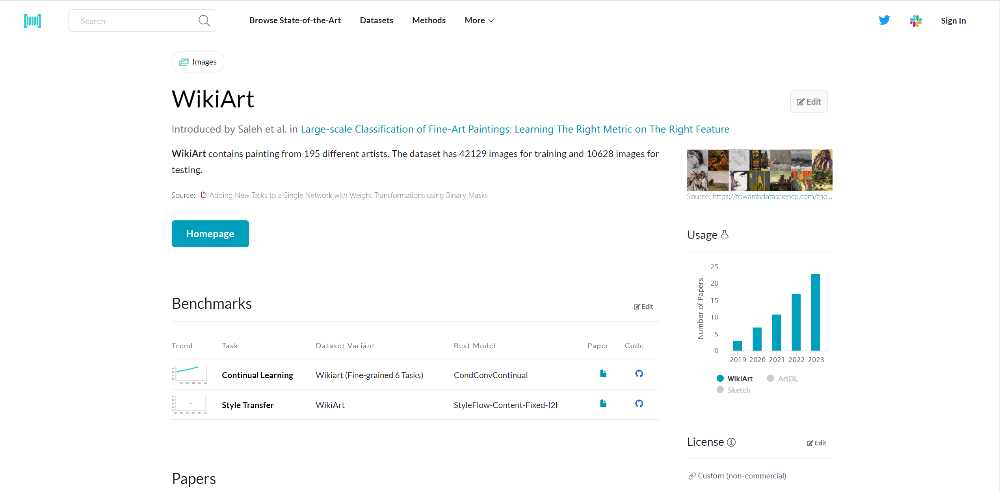{: style="height:300px;width:620px"}
    |          | https://github.com/cs-chan/ArtGAN/tree/master/ArtGAN  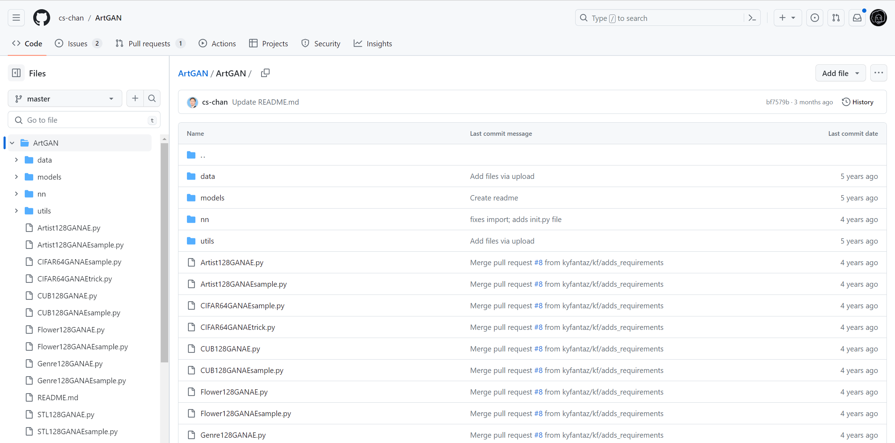{: style="height:300px;width:620px"}
    | Description | 	The WikiArt dataset contains paintings from 195 different artists. The dataset has 42129 images for training and 10628 images for testing. Because WikiArt is available to the public, it has a well-developed structure, WikiArt is often used in the field of machine learning. Namely, it is used to train AI on WikiArt data to discover its ability to recognize, classify, and generate art.
    | Interest | During my undergraduate studies, I pursued a double major in Interior Architecture and Art History. However, my particular passion lies in Art History. I am intrigued by the origins of each art movement, the underlying logic and philosophical aspects, and the reasons leading to their eventual ==manifestations==.
    |          | Throughout my exploration of Art History, I actively traced the ==roots== of each art movement, delving deep into their ==ideologies and philosophical foundations==. I gained a profound understanding of how societal, cultural, and historical factors influence art movements. I sought to comprehend the origins and development of these movements from an artistic perspective, considering the unique environments and social contexts of each period.
    |          | Each art movement is like a canvas saturated with the thoughts and reflections of artists of that time. I am excited by the unique creativity and ideas that emerge within these movements. Through artworks spanning different eras, I aim to understand how artists serve as cultural commentators of their times by expressing their viewpoints and emotions.
    |          | While pursuing a profound understanding of art movements, my interest extends to the evolution of their ultimate forms. I believe that interpreting artworks from ==logical and philosophical== perspectives ==not only aids in appreciating their aesthetics== but also reveals ==deeper layers of thoughts and emotions embedded in these creations==.
    |          | In summary, my academic background fuels my deep curiosity about the origins and development of art movements. I look forward to further exploring and understanding the cultural and philosophical implications of different art movements and how they have influenced the evolution and presentation of art.
  


    <center>
    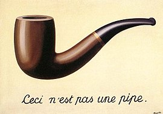{: style="height:300px;width:420px"}
    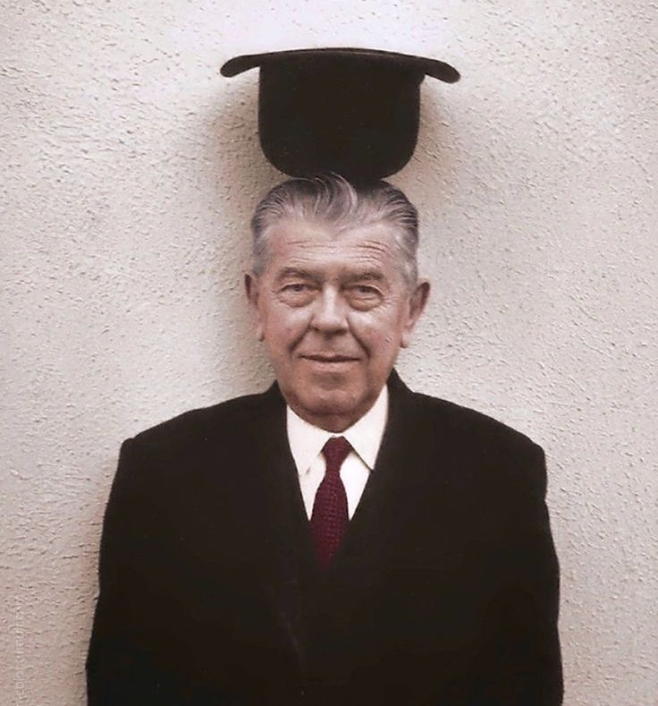{: style="height:300px;width:280px"}
    </center>

    !!! quote 
        ##“The famous pipe. How people reproached me for it! And yet, could you stuff my pipe? No, it’s just a representation, is it not? So if I had written on my picture “This is a pipe”, I’d have been lying!”  
        — wrote René Magritte about his brilliant concept and artwork “The Treachery of Images”.

        > This quote is from René Magritte, a famous surrealist artist, and it refers to his painting "The Treachery of Images" ("La trahison des images" in French). The painting features a pipe, accompanied by the text "Ceci n'est pas une pipe" (This is not a pipe) below it.

        >Magritte's statement reflects the philosophical idea that an image or representation is not the same as the real object it represents. The pipe in the painting is just an image of a pipe, not a functional pipe that one could smoke. The text challenges the viewer to consider the distinction between representation and reality.

        >Magritte's work often explored the relationship between words and images, and "The Treachery of Images" is a prime example of his fascination with the nature of perception and language in art. The painting invites viewers to question their assumptions about representation and prompts philosophical reflections on the nature of reality in art.

    !!! tip "For further FUTURE"
    1. Social and Historical Background:

        Examine the societal, political, and cultural environment of specific periods, understanding the social upheavals and intellectual trends that often influence the development of art.

    2. Artists and Thinkers:

        Study the major artists and thinkers within specific art movements, gaining insights into their perspectives, ideologies, creative motivations, and how they propelled the movement forward.

    3. Technological and Innovative Aspects:

        Investigate the technologies and innovations associated with art movements, including painting techniques, sculptural methods, photographic advancements, etc. Technological changes often play a significant role in the evolution of artistic forms.

    4. Artistic Theory:

        Understand the theoretical foundations of particular art movements, including considerations of artistic viewpoints, aesthetic concepts, and the philosophical reflections on artistic goals.

    5. Social Impact:

        Examine the societal impact of specific art movements, encompassing their influence on the public, critics, and other artists. Analyze how these movements resonate within the broader social context.

    !!!info "References"
        https://towardsdatascience.com/the-non-treachery-of-dataset-df1f6cbe577e


what kind of data (images, text, world)

what task you want to

different specific models of the same type of network

its internal functioning 


deep neural network


ex:
images (all the images should be in the files)


https://github.com/simonw/laion-aesthetic-datasette

!!! quote
    From Taco 2 CoCo 2 Yolo - Albert
    
    If for any reason the connection is broken. Just call me again- Colab

- [ ] Dataset for trash identification/ Taco,
- [ ] Train and model for Dataset for trash/ COCO/YOLO/ Colab
- [ ] Obj. classification data set 
- [ ] Neural Network

What catalog do we what to do for the Dataset for 2023/12/05
**Floder:**
* Cigarratte 
* Drink Can
* Foam Cup
* Negative=none of above

**For Future**
* Invite Generation Identify train model

AI --> Detect A Trash --> Trace the Information of the trash --> -Age-Material-Brand-


